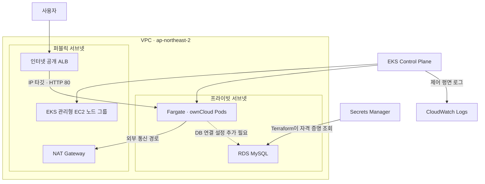

<div align="center">

# ☁️ Terraform · EKS · Fargate · RDS

### AWS 컨테이너 인프라를 코드로 구성하는 프로젝트

**VPC부터 Kubernetes 워크로드, 데이터베이스까지 Terraform 모듈로 관리합니다.**


[아키텍처](#-아키텍처) · [모듈 구성](#-모듈-구성) · [환경 설정](#-환경-설정) · [사용 방법](#-사용-방법) · [기술 블로그](https://blog.naver.com/pathfinder7777/223403836099)

</div>

---

## 📘 프로젝트 소개

AWS 인프라를 **Terraform 기반 Infrastructure as Code(IaC)**로 구성하는 학습 프로젝트입니다. 네트워크, EKS, Kubernetes 애플리케이션, RDS를 네 개의 모듈로 나누고, 환경별 변수 파일로 리소스 설정을 관리합니다.

EKS에는 **Fargate 프로파일과 EC2 관리형 노드 그룹을 함께 정의**합니다. 애플리케이션으로 ownCloud를 배포하며, ALB Ingress와 프라이빗 RDS MySQL 구성을 포함합니다.

> 이 문서는 저장소에 선언된 리소스를 기준으로 작성했습니다. 현재 코드에는 배포 전 보완할 설정이 있으며, 바로 적용 가능한 완성형 운영 템플릿이나 배포 성공을 보장하는 구성은 아닙니다.

## 🏗️ 아키텍처

아래는 코드가 의도하는 주요 배치와 연결입니다. 점선의 ownCloud–RDS 연결은 추가 설정이 필요한 부분입니다.



ALB는 Ingress 정의를 읽은 AWS Load Balancer Controller가 생성하는 구조입니다. `target-type: ip`가 설정되어 있으며, Ingress는 `ClusterIP` Service를 백엔드로 참조합니다.

### 구성 요약

| 영역 | 저장소에 선언된 구성 |
| --- | --- |
| 네트워크 | VPC 1개, 퍼블릭 3개·프라이빗 3개 서브넷, IGW, NAT Gateway 3개 |
| EKS | 클러스터, IAM 역할, OIDC Provider |
| EC2 노드 그룹 | 퍼블릭 서브넷 사용, 최소 2·희망 2·최대 3대 |
| Fargate | 프라이빗 서브넷 사용, `fargate-node` 네임스페이스 선택 |
| 애플리케이션 | `owncloud` 이미지, Deployment 복제본 2개 |
| 서비스 노출 | ClusterIP Service 및 인터넷 공개 ALB Ingress 정의 |
| 데이터베이스 | 프라이빗 RDS MySQL, DB Subnet Group, 보안 그룹 |
| 자격 증명 | Secrets Manager Secret 및 Secret Version |
| 로그 | EKS 제어 평면 로그 5종, CloudWatch 보존 기간 30일 |

서브넷과 NAT 개수는 제공된 두 변수 파일 기준입니다. 서브넷을 여러 AZ에 구성한 것과 RDS Multi-AZ 활성화는 별개이며, 코드에 `multi_az` 설정은 없습니다.

## 🧩 모듈 구성

Terraform 작업 디렉터리: [`terraform-aws-eks-fargate/`](terraform-aws-eks-fargate)

| 모듈 | 주요 리소스 | 연결 관계 |
| --- | --- | --- |
| [`vpc`](terraform-aws-eks-fargate/vpc/main.tf) | VPC, 서브넷, IGW, EIP, NAT, 라우팅 | VPC·서브넷 ID를 다른 모듈에 전달 |
| [`eks`](terraform-aws-eks-fargate/eks/main.tf) | EKS, 노드 그룹, Fargate, IAM, OIDC, 로그 | VPC 출력 사용, 클러스터 정보를 Kubernetes 모듈에 전달 |
| [`kubernetes`](terraform-aws-eks-fargate/kubernetes/main.tf) | 컨트롤러, ServiceAccount, IAM, Helm | 생성된 EKS의 API에 연결 |
| [`database`](terraform-aws-eks-fargate/database/main.tf) | RDS, DB 서브넷·보안 그룹, Secret | VPC의 프라이빗 서브넷 사용 |

ownCloud의 Namespace, Deployment, Service, Ingress는 [`kubernetes/app.tf`](terraform-aws-eks-fargate/kubernetes/app.tf)에 정의되어 있습니다.

## ⚙️ 환경 설정

| 항목 | `testing.tfvars` | `production.tfvars` |
| --- | --- | --- |
| 환경 이름 | `testing` | `Production` |
| 클러스터 이름 | `main-testing` | `main-Production` |
| EC2 인스턴스 유형 | `t2.micro` | `t3.xlarge` |
| RDS 인스턴스 클래스 | `db.t2.micro` | `db.m5.xlarge` |
| DB 스토리지 | 20 GiB · `gp2` | 100 GiB · `io1` |
| DB 엔진 설정 | MySQL `5.7` | MySQL `5.7` |
| Fargate 네임스페이스 | `fargate-node` | `fargate-node` |

위 값은 **저장소의 기존 설정값**입니다. 실제 사용 가능한 엔진 버전·인스턴스와의 호환성은 배포 시점에 확인해야 합니다. `production`이라는 파일명이 운영 적합성을 의미하지는 않습니다.

AWS Provider는 현재 `ap-northeast-2` 리전과 `default` 프로파일을 사용하도록 정의되어 있습니다.

## 🚀 사용 방법

### 1. 준비 및 코드 확인

Terraform, AWS CLI, kubectl과 배포 계정의 권한을 준비합니다. 이후 아래의 **배포 전 보완 사항**을 반영하고 사용할 Provider 버전을 결정합니다.

```powershell
git clone https://github.com/path0971/terraform-eks-fargate-rds.git
cd terraform-eks-fargate-rds/terraform-aws-eks-fargate
aws sts get-caller-identity --profile default
```

### 2. 초기화 및 계획 검토

```powershell
terraform init
terraform validate
terraform plan -var-file="testing.tfvars"
```

현재 저장소에는 Terraform·Provider 버전 제약이 명시되어 있지 않습니다. 설치되는 버전에 따라 기존 AWS·Helm 설정 구문을 수정해야 할 수 있습니다.

### 3. 검토한 구성 적용

코드 보완과 계획 검토를 완료한 경우 실행합니다.

```powershell
terraform apply -var-file="testing.tfvars"
```

EKS, EC2, Fargate, NAT Gateway, RDS 등 유료 리소스를 생성합니다. 특히 기본 구성은 NAT Gateway 3개와 EC2 노드 2대를 포함합니다.

> 변수 파일만 바꾸면 상태가 분리되는 것은 아닙니다. 환경별 state를 분리하고, 고정된 IAM 역할·Secret·보안 그룹 이름도 환경별로 구분한 뒤 여러 환경을 운영해야 합니다.

### 4. 클러스터와 워크로드 확인

`testing` 설정으로 클러스터가 생성된 경우:

```powershell
aws eks update-kubeconfig --region ap-northeast-2 --name main-testing --profile default
kubectl get nodes
kubectl get pods -n fargate-node -o wide
kubectl get svc,ingress -n fargate-node
kubectl get pods -n kube-system
```

Ingress의 `ADDRESS`, Pod 상태, 컨트롤러 로그를 확인합니다. 루트 [`output.tf`](terraform-aws-eks-fargate/output.tf)의 DB 엔드포인트와 서버 DNS 출력은 현재 주석 처리되어 있습니다.

## 🔧 배포 전 보완 사항

실제 코드에서 확인되는 설정을 정리했습니다.

| 항목 | 현재 상태 | 보완 방향 |
| --- | --- | --- |
| 컨트롤러 설치 | Helm Release와 직접 작성한 Deployment가 같은 컨트롤러를 정의 | 하나의 설치 방식으로 통일 |
| 컨트롤러 IAM | 정책 문서 data는 있으나 이를 생성·연결하지 않고 별도 정책 ARN 참조 | 설치할 컨트롤러 버전에 맞는 정책 생성 및 역할 연결 확인 |
| DB 자격 증명 | Secret Version 값이 코드에 직접 작성됨 | 값을 코드에서 분리하고 Terraform state 접근 통제 |
| DB 네트워크 | 3306 인바운드에 `0.0.0.0/0` 지정 | 앱에서 필요한 접근 범위로 제한; RDS 자체는 `publicly_accessible = false` |
| DB 스토리지 | 모든 환경에 `iops = 1000` 고정, testing은 `gp2` | 스토리지 유형에 맞게 IOPS 설정 분리 |
| Secret 조회 순서 | Secret Version data가 버전 생성 리소스에 직접 의존하지 않음 | 생성된 버전 참조 또는 의존성 명시 |
| 앱과 DB 연결 | Deployment에 DB 주소·인증 정보 설정 없음 | 사용할 ownCloud 이미지에 맞는 DB 연결 설정 추가 |
| 앱 데이터 저장 | PVC 및 영속 볼륨 설정 없음 | 파일 저장과 복제본 간 데이터 공유 설계 |
| 버전 관리 | Provider·Helm 차트 버전 미고정, 앱 이미지 태그 미지정 | 검증한 버전으로 고정 |
| 상태 관리 | 원격 backend 설정 없음 | 환경별 상태 분리와 잠금·접근 권한 설정 |

Fargate selector는 변수로 받지만 앱 네임스페이스는 `fargate-node`로 고정되어 있습니다. 값을 변경할 때 두 설정을 함께 맞춰야 합니다. `secret_id` 변수 역시 DB 모듈에 전달되지만 실제 Secret 이름은 `database`로 고정되어 있습니다.

## 🧹 리소스 정리

실습을 종료할 때는 적용한 환경과 같은 state·변수 파일로 삭제 계획을 확인합니다.

```powershell
terraform plan -destroy -var-file="testing.tfvars"
```

필요한 DB 데이터를 보존하고, RDS 최종 스냅샷 정책을 정한 뒤 삭제합니다. 현재 코드에는 `final_snapshot_identifier`와 `skip_final_snapshot`이 명시되어 있지 않아 삭제 전 설정 확인이 필요합니다.

```powershell
terraform destroy -var-file="testing.tfvars"
```

컨트롤러가 관리하는 ALB는 Ingress 삭제 시 함께 정리되는지 확인합니다. 컨트롤러를 먼저 제거하면 정리가 지연될 수 있으므로 Ingress와 ALB의 삭제 상태를 확인한 뒤 클러스터를 정리합니다.

## 📚 구축 기록

관련 구성과 리소스에 대한 설명은 기술 블로그에서 확인할 수 있습니다.

**[Terraform 기반 AWS 인프라 구축 기록 →](https://blog.naver.com/pathfinder7777/223403836099)**

---

<div align="center">

**Infrastructure as Code · Kubernetes · AWS**<br>
네트워크, 컨테이너 실행 환경, 데이터베이스를 모듈로 연결하는 인프라 구성

</div>
